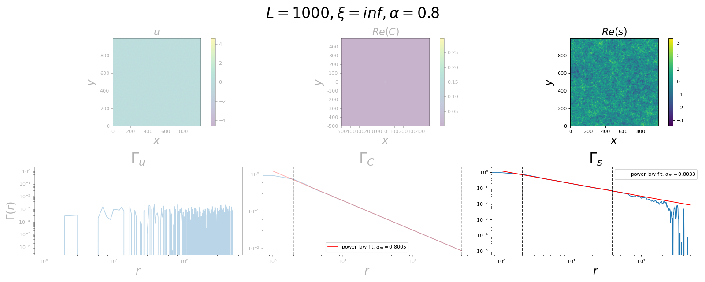

# Power Law Correlations in Elastoplastic Models: Implications for Critical Phenomena

## Introduction

The behavior of complex amorphous materials under stress is a topic of great interest in many fields, including mechanics, materials science, and geophysics. In particular, earthquakes often display critical phenomena, where the system exhibits power law statistics and is characterized by scale-invariance and self-organized criticality. In this study, we analyze an elastoplastic model under quasistatic loading, with a focus on the effects of inhomogeneities in the yield stress field on the emergence of power law behaviors. We consider a field with power law correlations and explore its effects on the material response. This study can be seen as a followup to the paper "Elastoplastic description of sudden failure in athermal amorphous materials during quasistatic loading" by Popović et al. (2018).

## Generating the yield stress field $\sigma^Y$

<!-- TODO: make difference between spatial average and realisations average -->

<!-- TODO: écrire tout en terme de white noise et pink noise -->

### Power law correlations

We would like to generate an inhomogeneous 2D-map $s(\vec{x}), \vec{x} \in \mathbb{R}^2$, which fulfills two requirements:

- The correlations between two sites at a distance $r$ should follow a power law (scale invariant patch sizes).
- It should exhibit some randomness (random patch locations).

The intuitive idea, which will be formalized below, is to start with a random (e.g. Gaussian) field $u(\vec{x}) \sim N(0,1), \forall \vec{x}$ that is completely uncorrelated, i.e. $\langle u(\vec{x}) u(\vec{x}-\vec{r}) \rangle = \delta_{r,0}$ and to "blur" it by convoluting it with a correlator $C(\vec{x})$. Hence, our $s$ will be decomposed as

$$ s(\vec{x}) = (C \ast u)(\vec{x}) $$

Our aim is to find which form $C(\vec{x})$ should take in order to obtain the desired behavior of $s(\vec{x})$. To this end, we will first have to formalize what we mean by power law correlations. Then, the use of the Fourier Transform (FT) will naturally arise because of its close relation to the concepts of convolution and autocorrelation. Once we are in Fourier space, operations will simplify greatly and we will finally be able to find an expression for the FT of the correlator $\tilde{C}$, or at least be able to impose the desired correlations numerically.

#### Correlation function

We start by defining the correlation function $\Gamma (r)$ between two sites separated by $\vec{r}$. We want it to follow a power law distribution, i.e.

$$    \Gamma (r) := \frac{\langle s(\vec{x})s(\vec{x}-\vec{r})\rangle}{\langle s^2 \rangle} \sim |\vec{r}|^{-\alpha}, \alpha > 0. $$

>**Note:** Here, we implicitely assumed $\langle s(\vec{x}) \rangle = 0$ everywhere, thus avoiding the subtraction in the covariance term (numerator). Also we consider a system which is invariant under translation and isotropic, s.t. $\Gamma$ is only a function of $r = |\vec{r}|$ and $\langle s^2 \rangle$ is well-defined. In the following, to simplify notation, we will assume $\langle s^2 \rangle = 1$, since by construction it will correspond to a constant factor which we can set to any desired value. We will also omit vector notation: for example, $x-r$ must be understood as $\vec{x} - r\vec{e}$, where $\vec{e}$ is a unit vector in any direction.

To begin, we introduce the fact that the correlation function can be understood as a convolution, which will prove useful when we start working with its FT.
To this end, we suppose that the field $s(x)$ is large enough to assume that averaging over different realisations is equivalent to averaging over the whole system, i.e. we can write $\Gamma(r) =  \langle s(x)s(x-r)\rangle = \frac{1}{L^d} \int s(x) s(x-r) dx$, where $L$ is the length of the system and $d$ the spatial dimension. This simply traduces the fact that we want to look at correlations *within* the system, rather than correlations *between* different realisations of it.
<!-- TODO: write paragraph with any quantity. Look at wiki: autocorrelation and when we can write it as an expectation. Wiener-Khinchin theorem -->
The above integral is known as the **autocorrelation** of the "signal" $s$ and can also be written in terms of the cross-correlation operator "$\star$":

$$\Gamma (r) = \frac{1}{L^d}(s\star s)(r).$$

>**Note** As claimed above, this is in fact equivalent to a convolution. Indeed, we can define $s'(x) := s(-x)$, which yields $\Gamma(r) = \frac{1}{L^d}(s\ast s')(r).$ In the following, we will stick to the autocorrelation point of view, but everything can be done in terms of convolutions.

The advantage of using this form of the correlation function is that we can simplify this operation by going to Fourier space. Remember that the convolution theorem states that the FT converts convolutions into multiplications ( $f \ast g \stackrel{F}{\rightarrow} \tilde{f} \cdot \tilde{g}$ ). It is easy to prove an equivalent theorem for the cross-correlation, with the only difference that the left term is replaced by its complex conjugate ( $f \star g \stackrel{F}{\rightarrow} \overline{\tilde{f}} \cdot \tilde{g}$ ). For the autocorrelation, we obtain the power spectrum: this result is called the Wiener–Khinchin theorem ( $f \star f \stackrel{F}{\rightarrow} |\tilde{f}|^2$ ). In our case:

$$ \tilde{\Gamma}(q) = \frac{1}{L^d}|\tilde{s}|^2(q). $$

#### Introducing randomness

By now, we already have a fairly simple relationship between $\Gamma$ and $s$, with which we could already try to impose power law correlations. However, we don't want to end up with a field that is smoothly correlated, but rather want to see randomly located patches. As stated above, an idea to introduce randomness is to split $s$ into two convoluted components, one for the randomness ( $u$ ) and one for the correlations ( $C$ ). In Fourier space, we have

$$ \tilde{s}(q) = \tilde{C}(q) \tilde{u}(q). $$

>**Note:** The only further constraint on $u$ is that we require $\langle u \rangle_{spatial} = 0$, or equivalently, $\tilde{u}(q) = 0$. Otherwise, as one can deduce from the equation above, $\langle s \rangle_{spatial}$ can fluctuate greatly for different realisations of $\tilde{u}(0)$, which is an unwanted effect. This ie even more relevant considering that, in general, $\tilde{C}(0)$ can be very large.

We now show that the random component $\tilde{u}$ doesn't intervene in the correlation function, except for a multiplicative constant. Indeed, using the exact same reasoning as before, but backwards, we get

$$ \frac{1}{L^d}|\tilde{u}|^2 = \frac{1}{L^d}F[u \star u] = F[\langle u(x)u(x-r)\rangle] = F[\delta_{r,0}] = 1, $$

where we used the uncorrelatedness of the random (e.g. Gaussian) field. Thus, as long as we choose any uncorrelated random field, we have a very simple equation relating the correlation function with the correlator:

$$ \tilde{\Gamma} = |\tilde{C}|^2 \iff \Gamma = C \star C$$

#### Derivation of $C$

We can now impose any correlation function $\Gamma$ desired. Since only the complex norm of $\tilde{C}$ is involved, an infinite number of correlators can lead to the same result, where the relationship between its real and imaginary parts is the degree of freedom (in real space, we can loosely see this as corresponding to the symmetry of $C$ around $x = 0$ ). For simplicity, we will opt for the natural choice $\tilde{C} \in \mathbb{R}$ with even symmetry: $\tilde{C}(q) = \tilde{C}(-q)$ [1]. In this convention,

$$ \tilde{C}(q) = \sqrt{\tilde{\Gamma}(q)},$$

which is our final expression for the correlator, provided we know $\tilde{\Gamma}.$
In practice, we can proceed in 2 differents ways:

1) $\alpha$ *method - Numerical:*
The first, and easiest method is to directly impose the power law: $\Gamma (r) \stackrel{!}{\sim} |r|^{-\alpha}$, and to proceed by numerically computing the expression for $\tilde{C}(q)$. In the code, we call this the "$\alpha$ method", as we can directly choose the exponent. However, in this case, we don't obtain an analytical expression for $\tilde{C}$.

2) $\beta$ *method - Analytical:*
We can try to bypass this restriction by analytically deriving $\tilde{\Gamma}(q) = F[\Gamma(r)] \sim F[|r|^{-\alpha}]$. Under certain conditions, the FT of a power law remains a power law [2]. In this case, $\tilde{C}(q)$ will be a power law with exponent $\beta$, s.t.
<!-- (*WHICH ONES?*) -->

$$
    \tilde{C}(q) \sim |q|^{-\beta} \iff \Gamma(r) \sim |r|^{2\beta - d},
$$

from which we finally derive a **relation between exponents**:

$$
    \alpha = d - 2\beta
$$

<!-- TODO: CITE SOMETHING FOR THE CUTOFF SIZE IN THE beta method case -->
>[1]: This is also going to be valid for the correlator $C$ in real space, due to the nice property of the FT: $f \in \mathbb{R}^d$ even $\iff F[f] \in \mathbb{R}^d$ even.
\
\
>[2]: $F[|\vec{x}|^{-\gamma}] \propto |\vec{q}|^{\gamma -d}$ in $\mathbb{R}^d$
\
\
>**Note 1:**
Using scale-invariant correlations, we are cursed with ever-growing patch sizes as our system size $L$ grows. Thus, in practice, we will use a cutoff size $\xi$, such that $\xi \ll L$. In the $\alpha$ method case, we can directly add an exponential cutoff $\Gamma (r) \stackrel{!}{\sim} |r|^{-\alpha} e^{-r/\xi}$. In the $\beta$ method case, one can show that using the correlator: $\tilde{C}(q) \sim \frac{1}{|q|^{\beta} + \xi^{-\beta}}$ will lead to similar results.
\
\
>**Note 2:**
Furthermore, $\Gamma(r)$ is singular at $r=0$, which we shall regularize by setting $\Gamma(0) = k$ for some $k>0$. The singularity would not be a problem in a continuous setting, since the point $r=0$ has a null measure in 2D space; however, in the discrete setting, pixels have a finite measure, and by keeping the singularity, the effect of the correlator would be to infinitely correlate each pixel of the initial gaussian with itself - which is equivalent to zero correlations with other pixels. We could set $k=0$, but the problem with this approach is that any point $s(x_0)$ will be independent of $u(x_0)$ and instead be a "weighted average" of the neighbourhood $u(x)$ for $x \in B_d(x_0)$, where $d$ is the typical scale of the power law which arises due to the regularization. Thus, small $\alpha \iff$ large $d$ will lead to an overall blurring, as this weighted average becomes increasingly homogeneous. To find the correct $k$, we need to integrate the power law around 0 in order to know which weight the center pixel should get.

<!-- TODO Make clear that this is only for method beta -->
<!-- TODO add limitation of continuous vs. discrete case -->

### Yield stress field $\sigma^Y$

We are now looking for a transformation $\sigma^Y$ = $f[s]$ which verifies the following conditions:

1. $\sigma^Y(x) > 0, \forall x$
2. $std(\sigma^Y) \ll \langle \sigma^Y \rangle$.

Note that we use the second condition as a first approach. Later, we will also look at cases where it doesn't hold.

For condition 1, the most natural choice of a positive function is the exponential. However, choosing $f[s] = e^s$ we could be significantly distorting our field $s$ by exploding bigger values, which would also conflict with condition 2. To avoid this, we use

$$f[s] = e^{ps}$$

instead, where we introduced a factor $p$ to scale down the range of $s$. Choosing $p \ll 1$, we can write $f[s] \approx 1 + ps$. This corresponds to rescaling and shifting $s$ to obtain

$$
\begin{align*}
\langle \sigma^Y \rangle &= 1, \\
std(\sigma^Y) &\approx p,
\end{align*}
$$

provided we initially normalized $s$ to $std(s) = 1$. This scale-shift also has the advantage to preserve power law correlations. Indeed the correlation functions of $s$ and $\sigma^Y$ differ only by a constant $\frac{p^2}{1+p^2}$:

<!-- TODO: write note about complex distributions -->

$$
\begin{align*}
\Gamma_\sigma(r) &= \frac{\langle \sigma^Y(x) \sigma^Y(x-r)] \rangle - \langle \sigma^Y(x) \rangle \langle \sigma^Y(x-r) \rangle}{\langle (\sigma^Y)^2 \rangle} \\ &=\frac{\langle [1+ps(x)] [1+ps(x-r)] \rangle - \langle [1+ps(x)] \rangle \langle [1+ps(x-r)] \rangle}{\langle[1+ps]^2\rangle} \\ &= \frac{1 + p^2 \Gamma(r) - 1}{1 + p^2} = \frac{p^2}{1+p^2}\Gamma(r).
\end{align*}
$$

### Implementation and limitations

#### Examples of field generations

To make things more intuitive, two examples of the whole procedure (i.e. including intermediary fields) are shown below, one for the $\alpha$-method and one for the $\beta$-method.
In step 1, each of the 3 fields $u$, $C$ and $s$ are plotted along with their FT. In step 2, we show $s$ again along with $\sigma^Y$. It should look the same, since it just corresponds to a shift, but we also restricted the colorbar to a range of 1 std above and below the mean, to make differences more visible.

##### $\alpha$-method

||
|:---:|
|**Step 1: Generating power law correlations**|
||
|**Step 2: Yield stress field $\sigma^Y$**|

##### $\beta$-method

||
|:---:|
|**Step 1: Generating power law correlations**|
||
|**Step 2: Yield stress field $\sigma^Y$**|

One can see that the two methods are not equivalent (note that exponent were chosen to satisfy the relationship between $\alpha = 2(1-\beta)$ ) The $\alpha$-method leads to a field that seems more "blurred".

It remains to be determined which are the advantages and disadvantages of each method. *A priori*, it is not clear whether there is a unique correct method - which would be the case if the final field is uniquely determined by its correlation function. We think there exist several different "ways" to obtain the same correlation function, even when starting from the same gaussian field $u$. However, some problems arise when actually trying to verify the power law correlations by measuring them, which is discussed in the next paragraph.

#### Verification of power law correlations

To verify numerically that we indeed obtain the desired behavior, we could brute-force calculate correlation statistics on realisations of our system, which requires to compute the product $s(x)s(x-r)$ for each pair of pixels for a fixed distance $r$, and this $\forall r$. This computation is expensive and goes as $\mathcal{O}(N^3)$ However, there is an easier way: we already showed that the correlation function can be written as $\Gamma (r) = \frac{1}{L^d} F^{-1}[|\tilde{s}|^2].$ This is way more efficient computationally, as the Fast Fourier Transform algorithm has a $\mathcal{O}(N\log{N})$ complexity.

A few examples of numerical correlation measurements in the case of the $\alpha$-method are shown in the figures below.

|**Working cases: $0.5 \lesssim \alpha \lesssim 1.2$**|
|:---:|
||
||
||
|For $L=1000$ and this range of $\alpha$, we obtain decent results for measured correlations. Only the long-range correlations (above $r\approx 10^2$ ) start to be noisy. This is due to the correlations in $u$ that are not exactly vanishing for finite $L$. Even if these fluctuations seem huge on a logarithmic scale, they are negligible on a linear scale and for our purposes. Also, they will vanish when averaging over different realisations.|
<!-- TODO: faire des moyennes sur plusieurs réalisations!! -->

|**Lower limit case: $\alpha = 0.1$**|
|:---:|
||
||
||
|For lower $\alpha$, i.e. a broad correlator, $\Gamma_s$ in log space becomes too concave for a power law. This is very striking in low $L$ cases, as can be seen in the $L=100$ case, where the disproportionately high short-range correlations result in a "blurring" effect. As one can see, the issue already starts in the correlation function $\Gamma_C$ (here, the regularization value at 0 (see **Note 2**) plays a role - since). However, it seems that the fluctuations in $\Gamma_u$ play a role too. For now, we will not use such low values for $\alpha$, but one should note that this unwanted effect diminishes for higher $L$, even if very slowly and with mediocre $\alpha_m$ values.|

|**Higher limit case: $\alpha > 2$**|
|:---:|
||
||
||
|As $\alpha$ grows, the correlator becomes too narrow and its decay is too fast compared to the pixel size, which also leads to a breakdown: the exponent measured in $\Gamma_C$ seems to converge to a value around $\alpha_m \approx 2.7$. Unlike before, this is not a finite $L$ effect, but a discretization effect - increasing the system size will have no effect on the relationship between the correlator decay and the pixel size. Furthermore, fluctuations in $u$ become non-negligible, since their magnitude quickly become comparable to the magnitude of the correlator, even at short distances. Visually, this is traduced into a map which is almost non distinguishable anymore from the original gaussian map - hence not interesting for our purposes.|
<!-- TODO: check if that makes sense since power law doesn't have a typical size. Then the only problem is the fluctuations in u. -->

#### Conclusion

For our project, we will probably use the $\alpha$-method, as its behavior is more predictable, especially for a reasonable range of values $0.5 < \alpha < 1.2$. We shall not take values over $\alpha > 2$, since this leads to vanishing correlations. On the other hand, lower values, $\alpha < 0.5$, would be interesting to investigate and we thus need to improve the procedure for this case.

## Elastoplastic model (EPM)

Our implementation of the EPM is essentially the same as the one used in "Elastoplastic description of sudden failure in athermal amorphous materials during quasistatic loading" by Popović et al. (2018). The code was simplified and adapted by T. de Geus and L. Bugnard. In the following, we provide a brief description of the conventions used.

### Brief description

We use an elastoplastic model which is:
<!-- TODO: cite something for the tensorial vs scalar values-->

- defined on a **2D square** system of **linear dimension L** (in pixels),
- under **pure shear** conditions,
- which, as an approximation, allows us to reduce tensorial stress and strain to **scalar** values.
- A **strain-driven** protocol is used,
- and the system is driven by **quasistatic loading**. This means that at each timestep, the overall stress is increased by the smallest possible value such that a single cell (the weakest) yields.
- This induces a **plastic strain** at the location of failure,
- and the stress release is then propagated through the system using an **Eshelby-like propagator**.
- This can lead to **avalanches**, i.e. new instabilities in other cells. The system thus needs to **relax**,
- which is done by sequentially choosing a **random cell among the unstable ones** and letting it yield in the same way, until all cells are stabilized.
- The **yield stresses** are **power law correlated** like described above.
<!-- TODO: Furthermore, each step corresponds to an **increase in time** of ...(*COMPLETE*) -->
<!-- Compléter le timestep. Bien différencier relaxation step ou spatial particle failure step -->

### Some clarifications

For completeness, we provide further detail about the system's initialization, the propagator and the updating of yield stresses:

- **Preparation:**
The initial stress is randomized, using a procedure which keeps its overall sum (and mean) to zero. Since it can not be ruled out that some cells are already unstable, the system is initially relaxed.
- **Propagator:**
We use the Eshelby elastic stress propagator $G^E(r) = \frac{cos(4\theta)}{\pi r^2}$, which is then discretized using the convention described by Rossi et al. (2022). It is adapted for a strain-driven protocol and allows to very easily evolve the system for each site $\sigma_j$ at each event-driven step using the single equation $\sigma_j \rightarrow \sigma_j + \Delta\sigma_{ext} + \sum_{i} G_{j,i} \Delta\sigma_i$, where $\Delta\sigma_{ext}$ is the applied quasistatic load, the $\Delta\sigma_i$ are the local failure stress drops and $G_{j,i}$ is the discretized propagator.
- **Updating of yield stresses:**
After a plastic event, we choose to sample a new yield stress for the location of failure from a normal distribution. The mean corresponds to the initial value, thus approximately preserving the initial yield map. The standard deviation is a parameter that can vary and quantifies to what extent the local resistance of the medium can vary.

### Examples of evolution

In the following, we show early examples of the evolution of the EPM under different parameters. An in-depth analysis remains to be done.

|**Reproducing the results of Popović et al. (2018)**|
|:---:|
||
||
|As expected, the effect of the initial stability on the material's response (Popović et al., 2018) in the case of a homogeneous yield stress field $\sigma^Y$ is also observed in our EPM: higher initial stability leads to shear localization in a narrow band.|

|**Introducing a heterogeneous yield stress field**|
|:---:|
||
|An interesting first observation is the emergence of a shear band which is not caused by a global failure, but persists in the stationary regime, as can be seen on the stress-strain curve. This is not observed in all cases, but for some ranges of parameters. Here. $\alpha = 0.8$ and $p = 0.5$.|

## Conclusion and next steps

As a result of this initial part of the project, we described two methods to generate 2D power law correlated random noise. We briefly analyzed the performance and limitations of the $\alpha$-method. As a followup, we could do the same for the $\beta$-method and possibly add other, widely used procedures, such as *pink noise* or *Perlin noise* generation.

We then proceeded to build an EPM model that suits our purposes, based on the work of Popović et al. (2018), which was tested on a few parameters and configurations. This opens up a wide range of questions and research directions. Some ideas for further analysis are studying how stationary shear bands emerge or the effect of the non-homogeneous yield stress field on the shape (roughness, thickness) of these bands. Most importantly, we will be trying to find traces of the power law and exponent used in the yield stress field.
