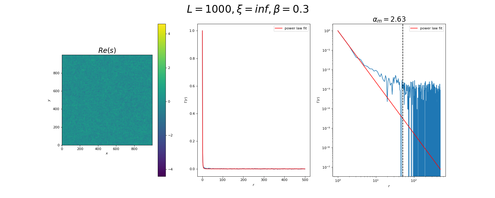

# Power law correlations
## Theory
### Step 1: Generating power law correlations
We would like to generate a random inhomogeneous 2D-map $s(\vec{x}), \vec{x} \in \mathbb{R}^2$, where the correlation $\Gamma (r)$ between two sites separated by $\vec{r}$ follows a power law distribution, i.e. 

$$    \Gamma (r) = \frac{\langle s(\vec{x})s(\vec{x}-\vec{r})\rangle}{\langle s^2 \rangle} \sim |\vec{r}|^{-\alpha}, \alpha > 0. $$

**Note:** Here, we implicitely assumed that the system is invariant under translation and isotropic, s.t. $\Gamma$ is only a function of $r = |\vec{r}|$ and $\langle s^2 \rangle$ is well-defined. In the following, to simplify notation, we will assume $\langle s^2 \rangle = 1$, since this is just a constant factor and we can effectively impose it. We will also omit vector notation: for example, $x-r$ must be understood as $\vec{x} - r\vec{e}$, where $\vec{e}$ is a unit vector in any direction.

The idea is to start with a Gaussian field $u(x) \sim N(0,1), \forall x$ that is completely uncorrelated, i.e. $\langle u(x) u(x-r) \rangle = \delta_{r,0}$ and to "blur" it by convoluting it with a correlator $C(x)$. Our aim is to find which form 
$C(x)$ should take in order to obtain the desired behavior of $s(x)$. We will show that its Fourier-transform (FT) $\tilde{C}(q)$ must necessarily follow a power-law itself. Switching to Fourier space is natural since the convolution $s(x) = (C \ast u)(x)$ is translated to a simple multiplication $\tilde{s}(q) = \tilde{C}(q) \tilde{u}(q)$.

To begin, we notice that the correlation function can be understood as a convolution as well. To this end, we suppose that the field $s(x)$ is large enough to assume that averaging over different realisations is equivalent to averaging over the whole system (*write a paragraph about this?*), i.e. we can write $\Gamma(r) =  \langle s(x)s(x-r)\rangle = \frac{1}{L^d} \int s(x) s(x-r) dx$, where $L$ is the length of the system and $d$ the spatial dimension. We then introduce the field $s'(x) := s(-x)$, which effectively turns $\Gamma$ into a convolution:

$$
    L^d\Gamma(r) = (s\ast s')(r).
$$
Using the convolution theorem, we can thus write 
$$
    \begin{aligned}
        L^d\tilde{\Gamma}(q) & = \tilde{s}(q) \tilde{s'}(q) \\ 
        & = \tilde{s}(q) \tilde{s}(-q) \\
        & = \tilde{u}(q) \tilde{u}(-q) \tilde{C}(q) \tilde{C}(-q)
        \tag{1.1}
    \end{aligned}
    
$$
and going back to real space and using the convolution theorem again twice:
$$
    \begin{aligned}
        \Gamma(r) & = (\langle u(x)u(x-z) \rangle \ast g(z))(r) \\
        &= g(r)
    \end{aligned}
$$
where we defined $g(z) = F^{-1}[\tilde{C}(q)\tilde{C}(-q)]$, $F^{-1}$ being the inverse FT, and we used the uncorrelatedness of the Gaussian field.

To obtain scale invariant correlations, $g(r)$ must follow a power law, and since the FT of a power law is again a power law [1], $\tilde{C}(q)\tilde{C}(-q)$ must do as well. A possible choice is
$$
    \tilde{C}(q) \sim |q|^{-\beta} \implies g(r) \sim |r|^{2\beta - d},
$$
from which we finally derive a **relation between exponents**:
$$
    \alpha = d - 2\beta
$$

**Note:**
Using scale-invariant correlations, we are cursed with ever-growing patch sizes as our system size $L$ grows. Thus, in practice, we will use a cutoff size $\xi$ in the correlator: $\tilde{C}(q) = \frac{1}{|q|^{\beta} + \xi^{-\beta}}$, s.t. $\xi \ll L$. One can show (?) that this corresponds to an exponential cutoff in correlations, starting around $r = \xi$.

Furthermore we will impose $\tilde{C}(0) = 0$. This allows us to shift the spatial average of $s$ to 0, which would otherwise be subject to random and extreme fluctuations in different system realisations, due to the randomness of $\tilde{u}(0)$.

>  [1]: $F[|\vec{x}|^{-\gamma}] \propto |\vec{q}|^{\gamma -d}$ in $\mathbb{R}^d$

### Step 2: Yield stress field $\sigma^Y$
We are looking for a transformation $\sigma^Y$ = $f[s]$ which verifies the following conditions:
1. $\sigma^Y(x) > 0, \forall x$
2. $std(\sigma^Y) \ll \langle \sigma^Y \rangle$

For condition 1, the most natural choice of a positive function is the exponential. However, choosing $f[s] = e^s$ we could be significantly distorting our field $s$ by exploding bigger values, which would also conflict with condition 2. To avoid this, we use 

$$f[s] = e^{ps}$$

instead, where we introduced a factor $p$ to scale down the range of $s$. Choosing $p \ll 1$, we can write $f[s] \approx 1 + ps$. This corresponds to rescaling and shifting $s$ to obtain 

$$
\begin{align*}
\langle \sigma^Y \rangle &= 1, \\
std(\sigma^Y) &\approx p,
\end{align*}
$$ 
provided we intially normalized $s$ to $std(s) = 1$. This scale-shift also has the advantage to preserve power law correlations.

### Limitations
The procedure described in the two previous steps has limitations on the values of $\beta$:
- $\alpha = 2(1-\beta)$ implies that we have to restrict ourselves to  $\beta < 1$ in order to keep $\alpha > 0$. Indeed, as can be seen further below, choosing $\beta > 1$ leads to correlations that are not distributed as a power law.
- Choosing $\beta \ll 1$ also leads to a breakdown, as the "correlator width" gets comparable to the pixel size, and our correlations become insignificant (the field $s$ looks just like the initial gaussian field $u$).

TODO: add s prefactor explanation

## Implementation
### Examples
Below are two examples of the whole procedure,for $\beta = 0.8, \xi \to \infty$  and $L = 100$ and $1000$ respectively. In step 1, each of the 3 fields $u$, $C$ and $s$ are plotted along with their FT. In step 2, we show $s$ again along with $\sigma^Y$. It should look the same, since it just corresponds to a shift, but we also restricted the colorbar to a range of 1 std above and below the mean, to make differences more visible.

**L = 100**

||
|:---:|
|**Step 1: Generating power law correlations**|
||
|**Step 2: Yield stress field $\sigma^Y$**|

**L = 1000**

||
|:---:|
|**Step 1: Generating power law correlations**|
||
|**Step 2: Yield stress field $\sigma^Y$**|

### Verification of power law correlations
To verify numerically that we indeed obtain the desired behavior, we could brute-force calculate correlation statistics on realisations of our system, which requires to compute the product $s(x)s(x-r)$ for each pair of pixels for a fixed distance $r$, and this $\forall r$. This computation is expensive and goes as $\mathcal{O}(N^3)$ However, there is an easier way, once more using the convolution theorem. We already showed in equation 1.1, that $\Gamma (r)$ can be written as $\Gamma (r) = \frac{1}{L^d}  F^{-1}[\tilde{s}(q)\tilde{s}(-q)]$. As $s(x)$ is real, its FT is symmetric around 0 up to complex conjugation, which yields 
$$
    \Gamma (r) = \frac{1}{L^d}  F^{-1}[|\tilde{s}|^2(q)].
$$
This is way more efficient computationally, as the Fast Fourier Transform algorithm has a $\mathcal{O}(N\log{N})$ complexity.

A few examples of numerical correlation measurements are shown in the figures below.

||
|:---:|
|**Power law behaviour for $\beta = 0.8$**|
|However, the measured exponent $\alpha_m = 0.64$ does not correspond to the predicted one $\alpha = 2(1-0.8) =0.4$. This is discussed further below.|

||
|:---:|
|**Breakdown for $\beta > 1$**|
|In this case, our analytical results are not valid anymore.|

||
|:---:|
|**Breakdown for $\beta \ll 1$**|
|In this case, the correlator is too narrow and we are left with an almost uncorrelated gaussian field.|

To better understand the relationship between $\beta$ and $\alpha_m$, several simulations were made for a range of $\beta$'s and $L$'s. The plot below shows the results, along with the predicted behaviour $\alpha = 2(\beta -1)$.

||
|:---:|
|**$\alpha_{m}$ vs. predicted $\alpha$**|
|We see that we fail to predict correct values for small $\beta$'s, no matter the system size $L$. This is due to resolution issues: the correlator has a width comparable to the pixel size. This doesn't depend on $L$ in our procedure, so increasing it doesn't solve the problem. For intermediary $\beta$'s, the prediction is slightly off, which is still an issue. For $\beta$'s close to 1, we see that $\alpha_m$ tends towards a plateau.|

**Note:** As can be seen in these figures, the procedure doesn't give optimal results, we still have to figure out how to enhance it.

# Evolution
TODO: explain our model choice

TODO: section about propagator